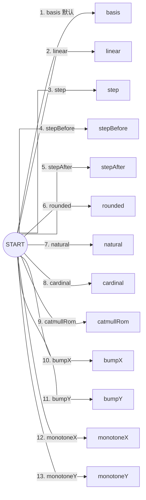

# 🧜‍♀️ Online Mermaid

Online Mermaid 是一个轻量、优雅、全功能包含的**单二进制在线 Mermaid 流程图与图表编辑器**。它基于 **Go 1.24** 与 **Vue 3** 开发，采用现代化的全栈工程架构，内置纯 Go SQLite3 存储，全量前端生产资源直接内嵌在单个可执行文件中，发布部署无需在服务器上安装 Node.js 或前端运行环境。

---

## ✨ 核心特性

- **📦 单二进制开箱即用**：前端与 Go 后端编译为单个极简二进制，跨平台无外部依赖，下载即可运行。
- **🗃️ 零文件系统依赖的 SQLite 存储**：
  - 图表源码与元数据持久化存储于本地 SQLite 数据库（自动建表并迁移）；
  - 支持新图表自动递增命名（`graph1`, `graph2`, `graph3`...）；
  - 内置空代码覆盖保护与防丢失安全机制。
- **📊 稳定可靠的 Mermaid 渲染内核**：
  - 固定集成 **Mermaid 11.15.0** 官方渲染引擎，杜绝版本波动；
  - 深度配置 SVG `<text>` 渲染管道与 DOMPurify 净化规则（`dominant-baseline` / `alignment-baseline`），彻底解决流程图节点文字显示异常；
  - 自动计算天然 ViewBox 保持比例，避免 Flex 弹性盒模型下的挤压与失真。
- **📑 预览、编辑与分屏三大视图模式**：
  - **👁 预览模式**：专注全画幅高清呈现与图表审阅；
  - **✏️ 编辑模式**：全屏沉浸式代码编写，附带快捷模版示例（Flowchart、Sequence、Class、State、ER、Gantt、Pie、GitGraph 等）；
  - **📑 分屏模式**：PC 模式左右实时双向渲染；移动端自动自适应为纵向堆叠布局。
- **📈 强大的图形交互与导出工具箱**：
  - **画布平移与缩放 (Panzoom)**：支持鼠标滚轮无级缩放、按住平移拖拽、双指捏合（Pinch-to-zoom）与一键重置视角；
  - **多样化导出格式**：
    - 一键复制白底 PNG 图片到剪切板（`copy`）；
    - 导出透明背景高清 PNG（`image`）；
    - 导出标准 SVG 矢量文件（`svg`）；
    - 一键复制 Mermaid 源码（`file-code`）。
  - **全屏模态与 90° 旋转审阅**：独家支持全屏状态下一键 **90° 旋转**，专为移动端手机竖屏查看超宽架构图设计。
- **📱 极致移动端体验 (Mobile First)**：
  - 顶部标准 3 横线汉堡按钮（`☰`）呼出侧边抽屉菜单，磨砂遮罩平滑过渡；
  - 移动端自动隐藏顶栏冗余文件名，释放宝贵的操作区域；
  - 触控热区全面优化（`>= 44px`），移动端输入框字号 16px 防 iOS 自动缩放。
- **☀️ 日夜主题无缝切换**：支持浅色模式（Day）、深色夜间模式（Night）与跟随系统（System），图表渲染与编辑器同步响应切换。
- **🔒 极简安全认证与用户子菜单**：
  - 顶栏右侧将退出按钮统一收敛至用户下拉子菜单（`.user-dropdown`），展示用户状态与一键退出；
  - 基于 bcrypt 密码哈希与安全的 HttpOnly Cookie session 认证。
- **💾 本地草稿容灾恢复**：实时检测 LocalStorage 草稿，异常关闭或误刷新后支持一键提示恢复或放弃。

---

## 📊 Mermaid 流程图连线类型（flowchart.curve）

Online Mermaid 支持通过 `flowchart.curve` 控制流程图连接线的渲染观感。项目默认采用 `flowchart: { htmlLabels: false, curve: 'rounded' }`，即默认**圆角折线**；当连接线较多时，可自由调整连线类型以优化视觉呈现。

> 调整方式：
> 1. **单张图（图内指令）**：在 Mermaid 代码块首行加入 `%%{init: {"flowchart": {"curve": "linear"}}}%%`；
> 2. **单条边（逐边指定）**：在边上使用 `edgeId@{ curve: 类型 }` 语法单独指定该条边的曲线类型。

### 一、支持的 `curve` 类型列表

| 类型 | 说明 | 特点 / 适用场景 |
| :--- | :--- | :--- |
| **`basis`** *(默认值)* | B-样条平滑曲线 | 柔和弧线，不一定穿过控制点，Mermaid 默认渲染方式 |
| **`linear`** | 直线 / 折线 | 节点与拐点之间用直线直连（无平滑弧度） |
| **`step`** | 阶梯折线（中间转折） | 水平与垂直交替，在两点正中间转折 |
| **`stepBefore`** | 阶梯折线（先转折） | 水平/垂直阶梯连线，转折点靠近起点 |
| **`stepAfter`** | 阶梯折线（后转折） | 水平/垂直阶梯连线，转折点靠近终点 |
| **`rounded`** | 圆角折线 | 类似阶梯/正交折线，拐角处具有平滑圆角过渡 |
| **`natural`** | 自然三次样条曲线 | 一条穿过所有点的平滑三次样条曲线 |
| **`cardinal`** | Cardinal 样条曲线 | 穿过所有控制点的样条曲线 |
| **`catmullRom`** | Catmull-Rom 样条曲线 | 类似于 Cardinal，张力更平滑自然 |
| **`bumpX`** | 水平凸起曲线（S 形平滑） | 适合从左到右（LR / RL）排列的平滑贝塞尔曲线 |
| **`bumpY`** | 垂直凸起曲线（S 形平滑） | 适合从上到下（TB / TD）排列的平滑贝塞尔曲线 |
| **`monotoneX`** | 单调 X 三次曲线 | 保持 X 方向单调性，避免过冲波动（适合横向流） |
| **`monotoneY`** | 单调 Y 三次曲线 | 保持 Y 方向单调性，避免过冲波动（适合纵向流） |

### 二、示例（用 Edge ID 逐边指定 13 种 curve）



---

## 🚀 快速部署指南

适合绝大多数个人服务器、VPS 或本地环境，无需 root 权限即可一键启动。

### 1. 下载预编译二进制

从 [GitHub Releases](https://github.com/GreyRaphael/online_mermaid/releases) 页面下载适合您系统架构的最新压缩包并解压：

```bash
# 示例：Linux x86_64
wget https://github.com/GreyRaphael/online_mermaid/releases/download/v1.0.0/online-mermaid-v1.0.0-linux-amd64.tar.gz
tar -zxvf online-mermaid-v1.0.0-linux-amd64.tar.gz
chmod +x online-mermaid
```

### 2. 生成管理员密码哈希

使用内置的交互式命令生成加密密码，避免明文密码出现在 shell 历史记录中：

```bash
./online-mermaid hash-password
```

输入自定义密码后，程序将输出类似于 `$2a$10$e8Z...` 的 bcrypt 哈希字符串。

> 💡 **提示**：若未配置密码哈希，程序默认使用用户名 `admin` / 密码 `admin123` 启动。

### 3. 运行服务

#### 方式 A：前台直接启动
```bash
export ONLINE_MERMAID_ADMIN_PASSWORD_HASH='$2a$10$...'
./online-mermaid --addr 0.0.0.0:8850
```

#### 方式 B：nohup 后台运行
```bash
export ONLINE_MERMAID_ADMIN_PASSWORD_HASH='$2a$10$...'
nohup ./online-mermaid --addr 0.0.0.0:8850 > online-mermaid.log 2>&1 &
```

#### 方式 C：普通用户 systemd 守护进程（推荐，开机自启）

无需 root / sudo 权限即可建立持久化守护进程：

1. 创建用户服务目录并新建配置文件：
   ```bash
   mkdir -p ~/.config/systemd/user/
   nano ~/.config/systemd/user/online-mermaid.service
   ```

2. 写入以下内容（替换密码哈希与路径）：
   ```ini
   [Unit]
   Description=Online Mermaid Service
   After=network.target

   [Service]
   Type=simple
   ExecStart=%h/bin/online-mermaid --addr 0.0.0.0:8850 --db-path %h/.config/online-mermaid/mermaid.db
   Environment="ONLINE_MERMAID_ADMIN_PASSWORD_HASH=$2a$10$..."
   Restart=always
   RestartSec=5s

   [Install]
   WantedBy=default.target
   ```

3. 启动服务并开启开机自启：
   ```bash
   systemctl --user daemon-reload
   systemctl --user enable --now online-mermaid

   # 允许用户离线时后台服务继续驻留运行
   loginctl enable-linger $USER
   ```

4. 查看服务状态：
   ```bash
   systemctl --user status online-mermaid
   ```

---

## ⚙️ 进阶配置参数说明

服务支持通过命令行参数或环境变量进行配置。命令行参数优先级高于环境变量。

| 命令行参数 | 环境变量 | 默认值 | 说明 |
| :--- | :--- | :--- | :--- |
| `--addr` | `ONLINE_MERMAID_ADDR` | `0.0.0.0:8850` | HTTP 服务监听地址 |
| `--db-path` | `ONLINE_MERMAID_DB` | `~/.config/online-mermaid/mermaid.db` | SQLite 数据库持久化路径 |
| `--admin-user` | `ONLINE_MERMAID_ADMIN_USERNAME` | `admin` | 管理员登录用户名 |
| `--password-hash` | `ONLINE_MERMAID_ADMIN_PASSWORD_HASH` | 默认 `admin123` 哈希 | 管理员 bcrypt 密码哈希 |
| `--session-ttl` | `ONLINE_MERMAID_SESSION_TTL` | `72h` | 登录 Session 有效期 |
| `--secure-cookie` | `ONLINE_MERMAID_SECURE_COOKIE` | `false` | 启用 HTTPS 部署时请开启该参数 |

---

## 🛠️ 本地开发与从源码构建

### 环境要求
- **Go 1.24+**
- **Node.js 20+**
- **pnpm 11+**

```bash
# 1. 编译全量前端资源与 Go 服务二进制
make build

# 2. 运行后端与前端自动化测试
make test

# 3. 运行 Playwright E2E 双端（PC + 移动端）测试
make test-e2e

# 4. 本地直接运行
make run
```

编译生成的可执行文件位于 `bin/online-mermaid`。

---

## 📦 GitHub Release 跨平台构建说明

项目配置了完整的 `.github/workflows/release.yml` 自动化发布工作流。当推送形如 `v1.x.x` 的 Git Tag 时，GitHub Actions 会自动编译生成以下架构的单二进制发布包：

- **Windows (x64)**: `online-mermaid-vX.Y.Z-windows-amd64.zip`
- **Linux (x64)**: `online-mermaid-vX.Y.Z-linux-amd64.tar.gz`
- **Linux (ARM64)**: `online-mermaid-vX.Y.Z-linux-arm64.tar.gz`
- **macOS (Intel)**: `online-mermaid-vX.Y.Z-darwin-amd64.tar.gz`
- **macOS (Apple Silicon)**: `online-mermaid-vX.Y.Z-darwin-arm64.tar.gz`

---

## 🔐 安全须知与 FAQ

### Q: 在服务器通过 HTTP 访问时，点击“复制图片”提示「剪切板写入受限」？

* **原因分析**：
  现代浏览器对异步剪切板写入 API（`navigator.clipboard.write`）有严格的 **安全上下文（Secure Context）** 限制。
  - 在本地 `localhost` / `127.0.0.1` 访问时，浏览器默认为安全上下文；
  - 在远程服务器通过普通 HTTP IP 访问时，浏览器出于安全限制会禁用直接写入剪切板。

* **解决方案**：
  1. **方案 A（推荐）**：配置 Nginx / Caddy 反向代理并启用 HTTPS 证书；
  2. **方案 B（替代操作）**：直接点击工具栏的 **「导出透明 PNG」** 或 **「导出 SVG」**，文件下载不受 HTTP 协议限制；
  3. **方案 C（局域网免证书）**：在 Chrome / Edge 中打开 `chrome://flags/#unsafely-treat-insecure-origin-as-secure`，填入服务地址并设为 **Enabled** 重启浏览器。
